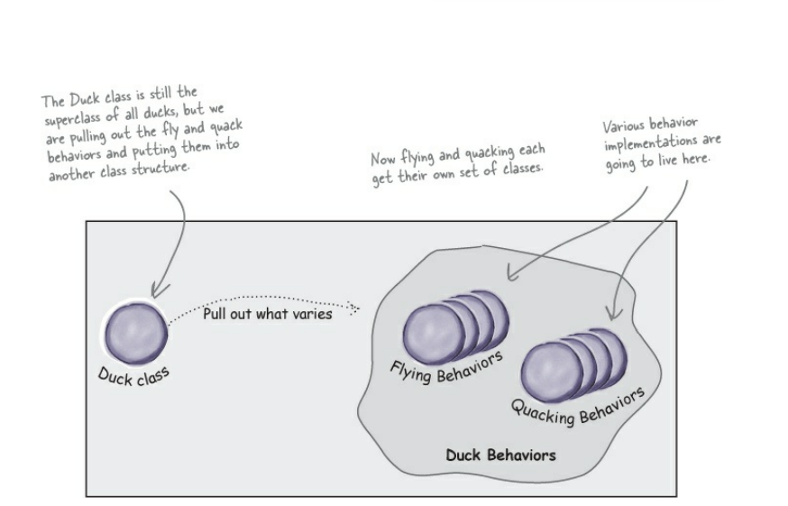

# Design Patterns

## Prerequisites

- OOP Principles
  - inheritance
  - abstraction
  - polymorphism
  - encapsulation
- references
  - videos
    - <https://www.youtube.com/watch?v=pTB0EiLXUC8>
  - articles
    - <https://medium.com/@cancerian0684/what-are-four-basic-principles-of-object-oriented-programming-645af8b43727>
    - <https://www.roberthalf.com/blog/salaries-and-skills/4-advantages-of-object-oriented-programming>

## Recommended to Know

- Declarative vs Imperitive Paradigm
  - <https://dev.to/ruizb/declarative-vs-imperative-4a7l#:~:text=Declarative%20programming%20is%20a%20paradigm,which%20mutate%20the%20program's%20state.>

- Vue options API vs composition API
  - <https://vuejs.org/guide/extras/composition-api-faq.html#what-is-composition-api>

- Design Pattern vs Anit Pattern

## Anti Pattern

- in software engineering , project management and business process is common response to a recurring problem that is usually ineffecive
- have highly risks ,  imacts , hard maintenance , not scalable

## Design Pattern

- common Problems
- OOP , algorithms , Data structure

# Strategy Pattern

## Bussiness Requirements

- We Have a Duck Game that Simulate Different types of Ducks spiecs
- First release happens with just 1 type of Ducks (white Duck)
- Initial Release have the following features
  - display() // abstract cuz each type have its look
  - quack() // all ducks quacks
  - swim() // all ducks swim
- followed releases new types added (Millard , RedHead  , ....)
  - Millard
    - info , type , name
  - RedHead
    - info , type , name
- Client update requirements : we need Ducks to fly
- Client will update features or add to it or add new types each 2 monthes

## Design Strategies

- all in One > generic Card (anti pattern : God Object and God Class)
- sperated types using inheritance
- sperated types using abstraction
- sperated types using strategy pattern

## All in One File

- advantages :
  - one component gives me multi choices
  - low redundancy and 1 place for change
- disatvantages
  - while advantage is multi choices but that contrast with single responsibility  , open closed principles
  - each new type will be included in the same file that makes readabiliy impossible by time
  - each change happens in the same file (increase impacts possibility )
  - hard in testing : testing for the same component will be updated for each change happend and we will need to run all previous test cases too

## sperated types using inheritance

- advantages
  - increase code reuseability in shared states and behaviours
- disatnavtages
  - each new type with different behaviour will inherit the wrong behaviour
  - each new type that have different behaviour will need to override default one and that reduce reusability
  - if we want to change overriden  behaviours , we need to change them in all these types again ( increase impacts , big changes )

## sperated types using abstraction

- advantages
  - subTypes with different behaviours will not inherit the wrong behaviour by default
- disadvantages
  - distroy reusability as we need to implement behaviour in each type even they are the same behaviour
  - changing will require to change in each type

## Design Target

- software that change with the least possible impacts on the existing code
  
## Benefits

- less reworking time
- spend more time in upgrading features

## How to target Strategy Pattern using Design Principles

### Designing Duck Class

- Design Principle :  Identify the aspects of your application that vary and separate them from what stays the
same.


### Designing the Duck Behaviours

- we need to initiate Duck with specific behaviour and
- make sure we can change behaviour dynamically

- Design Princple : Program to an interface, not an implementation.

```js
// programming to an implementation
const dog = new Animal();
dog.makeSound();
// programming to an interface
const dog = getAnimal();
dog.makeSound();
// note : all we care about here that we know dog knows how to respond on makeSound
 ```

 ```js
 // useDuck.js
 const flyBehaviour = flyWithWings(); // to an implementation
 const flyBehaviour = getBehaviour(); // to an interface
flyBehaviour.fly();
flyBehaviour.stopFly();
 ```

- Design Principle : Favour Composition over inheritance
  - HAS-A can be better than IS-A
  - instead of inheriting behaviour we composed them with the right behaviour object
  - you can inherit single behaviour but u can compose multiple behaviours
```js
// IS-A relationship
class Duck{
  // remove all changing behaviours 
} 
class DuckWithWings extends Duck{
  // add flybehaviour with wings
}
class WhiteDuck extends DuckWithWings{
  // u cant change flybehaviour here
  // u cant inherit quackbehaviour here
}
// HAS-A relationship
class Duck{
  // compose all behaviours here 
} 
class WhiteDuck extends Duck {
  // u can init the right behaviour and setting it at runtime
}
```


```js
class Duck {
  // abstract behaviour fly , quack
}
class DuckWithWings extends Duck{
  // implement fly behaviour
}

class DuckFeedRice extends DuckWithWings {
  // your new change
}

class WhiteDuck extends DuckWithWings{

  // fly with wings behaviour
}
```

```js
class Duck {
  flyBehaviour;

  performFly(){

  }
}
// 1000
class WhiteDuck extends Duck {
    constructor(flyBehaviour) {
      this.flyBehaviour
    }
}

class Rubber extends Duck {

}
```

```js
// services example
axios.get(`/${window[lang]}/home/users`);
axios.get(`/${window[lang]}/home/users`);
axios.get(`/${window[lang]}/home/users`);
axios.get(`/${window[lang]}/home/users`);

axios.get(`/${window[lang]}/home/list`);

createNewRequest(httpConstants.HttpTypes.GET , 
    'domain/lang/home/users' , {} )

// homeService.js
export   const getUsers = ()=> {
    // return axios.get(`/${window[lang]}/home/users`);
    return axios.get(`/${window[lang]}/home/users`);
}

export   const getList = ()=> {
    // return axios.get(`/${window[lang]}/home/users`);
    return axios.get(`/${window[lang]}/home/users`);
}

export   const getData = ()=> {
    // return axios.get(`/${window[lang]}/home/users`);
    return axios.get(`/${window[lang]}/home/users`);
}

// userService 
export   const login = ()=> {

    // return axios.get(`/${window[lang]}/home/users`);
    return axios.get(`/${window[lang]}/users/login`);
}
export   const register = ()=> {
    // return axios.get(`/${window[lang]}/home/users`);
    return axios.get(`/${window[lang]}/users/register`);
}
export   const logOut = ()=> {
    // return axios.get(`/${window[lang]}/home/users`);
    return axios.get(`/${window[lang]}/users/logout`);
}

// component1.js .. app 1
import {getUsers} from "./homeServices.js"
axios.get(`/${window[lang]}/api/home/users`);
getUsers()
.then((res)=>{
    res.data.success
}).catch()
;

// component2.js app 1
// call another request
axios.get(`/${window[lang]}/home/users`);
getUsers()
.then((res)=>{
    console.log(res)
});
// 
```

## Definition
- The Strategy Pattern defines a family of algorithms,
encapsulates each one, and makes them interchangeable. Strategy
lets the algorithm vary independently from clients that use it.

## When avoid using
- if ur re in development process and already all algorithms implemented.
- when u cant have a fixed API for these algorithms